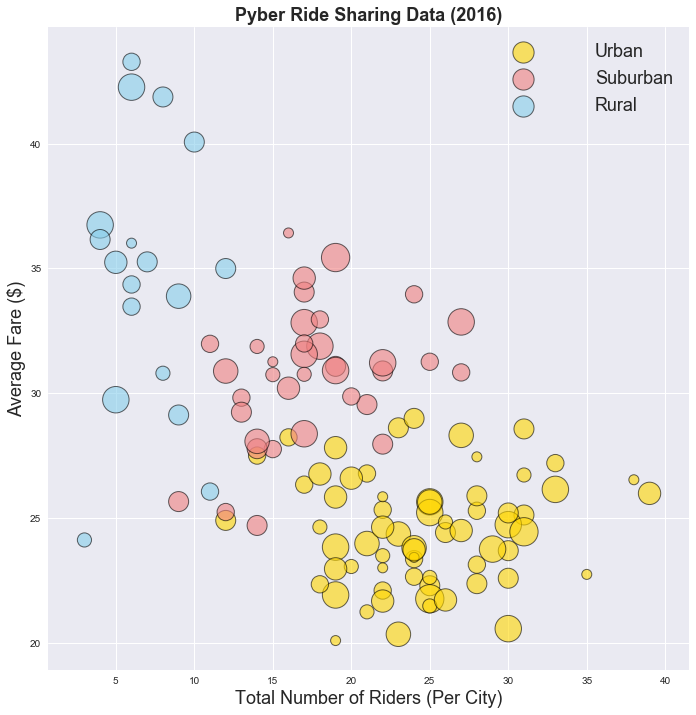

# Pyber Ride Sharing
## Andrew Kling - UNCC HW5

### Analysis
    - The majority of Pyber's fare revenue (62.7%) comes from Urban areas
    - There is a clear distinction between rural, suburban and urban driving distances.  Rural fares tend to be the longest rides while urban are the shortest.
    - The number of drivers in Pyber's fleet is adequately sized to service the number of riders in all city types


```python
#Andrew Kling
#UNCC HW#5 - Visualization of ride sharing data

import os
import pandas as pd
import matplotlib.pyplot as plt
import seaborn as sns
plt.rcParams['lines.markeredgewidth'] = 1
```


```python
#import data into dataframes
city_df = pd.read_csv(os.path.join("raw_data","city_data.csv"))
ride_df = pd.read_csv(os.path.join("raw_data","ride_data.csv"))
#merge two dataframes into one
data_df = ride_df.merge(city_df, how='left',on="city")
data_df.head()
```


<div>
<style>
    .dataframe thead tr:only-child th {
        text-align: right;
    }

    .dataframe thead th {
        text-align: left;
    }

    .dataframe tbody tr th {
        vertical-align: top;
    }
</style>
<table border="1" class="dataframe">
  <thead>
    <tr style="text-align: right;">
      <th></th>
      <th>city</th>
      <th>date</th>
      <th>fare</th>
      <th>ride_id</th>
      <th>driver_count</th>
      <th>type</th>
    </tr>
  </thead>
  <tbody>
    <tr>
      <th>0</th>
      <td>Lake Jonathanshire</td>
      <td>2018-01-14 10:14:22</td>
      <td>13.83</td>
      <td>5739410935873</td>
      <td>5</td>
      <td>Urban</td>
    </tr>
    <tr>
      <th>1</th>
      <td>South Michelleport</td>
      <td>2018-03-04 18:24:09</td>
      <td>30.24</td>
      <td>2343912425577</td>
      <td>72</td>
      <td>Urban</td>
    </tr>
    <tr>
      <th>2</th>
      <td>Port Samanthamouth</td>
      <td>2018-02-24 04:29:00</td>
      <td>33.44</td>
      <td>2005065760003</td>
      <td>57</td>
      <td>Urban</td>
    </tr>
    <tr>
      <th>3</th>
      <td>Rodneyfort</td>
      <td>2018-02-10 23:22:03</td>
      <td>23.44</td>
      <td>5149245426178</td>
      <td>34</td>
      <td>Urban</td>
    </tr>
    <tr>
      <th>4</th>
      <td>South Jack</td>
      <td>2018-03-06 04:28:35</td>
      <td>34.58</td>
      <td>3908451377344</td>
      <td>46</td>
      <td>Urban</td>
    </tr>
  </tbody>
</table>
</div>


```python
#get total number of riders per city and reformat dataframe
total_rides = pd.DataFrame(data_df["city"].value_counts())
total_rides = total_rides.reset_index()
total_rides = total_rides.rename(index=str, columns={"index": "city", "city": "total_rides"})

#get average fare per city and reformat dataframe
avg_fare = pd.DataFrame(data_df.groupby(["city"])["fare"].mean())
avg_fare = avg_fare.reset_index()
avg_fare = avg_fare.rename(index=str, columns={"fare":"avg_fare"})

#merge all data for bubble chart into one dataframe
plot_df = city_df.merge(total_rides, how='left',on='city')
plot_df = plot_df.merge(avg_fare, how='left',on='city')
```

# Bubble Plot of Ride Sharing Data


```python
#Create different bucket sizes for number of drivers per city
sizes = [100,200,300,400,500,600,700,800]
marker_size = pd.cut(plot_df["driver_count"], [0,10,20,30,40,50,60,70,80],labels=sizes)

sns.lmplot("total_rides","avg_fare",data=plot_df,palette={"Urban":"gold","Suburban":"lightcoral","Rural":"skyblue"},hue='type',
           legend_out=False,fit_reg=False,scatter_kws={'s':marker_size,'alpha':0.6,'edgecolor':'k'},size=10)

plt.rc('font', size=18)          # controls default text sizes
plt.rc('axes', titlesize=18)     # fontsize of the axes title
plt.rc('axes', labelsize=18)    # fontsize of the x and y labels

plt.rc('figure', titlesize=18)  # fontsize of the figure title
plt.rc('legend', fontsize=18)  # fontsize of the figure title

plt.title("Pyber Ride Sharing Data (2016)",fontweight="bold")
plt.xlabel("Total Number of Riders (Per City)")
plt.ylabel("Average Fare ($)")
plt.legend(handletextpad=3)
plt.show()
```





# Total Fares by City Type


```python
total_fares = data_df["fare"].sum()
fares_by_type = data_df.groupby(["type"])["fare"].sum()
fares_by_type = pd.DataFrame(fares_by_type / total_fares * 100)
fares_by_type = fares_by_type.reset_index()
fares_by_type = fares_by_type.rename(index=str, columns={"fare":"Percentage of Fares"})

plt.pie(fares_by_type["Percentage of Fares"],explode=[.05,.05,0], colors=["gold","lightcoral","skyblue"],
        labels=fares_by_type["type"], autopct='%1.1f%%',shadow=True,startangle=180, textprops={'fontsize':18})
plt.title("% of Total Fares by City Type",fontweight="bold")
plt.axis('equal')
plt.tight_layout()
#plt.rcParams.update({'font.size':18})
plt.show()
```


# Total Rides by City Type


```python
total_rides = data_df["ride_id"].count()
rides_by_type = data_df.groupby(["type"])["ride_id"].count()
rides_by_type = pd.DataFrame(rides_by_type / total_rides * 100)
rides_by_type = rides_by_type.reset_index()
rides_by_type = rides_by_type.rename(index=str, columns={"ride_id":"Percentage of Rides"})

plt.pie(rides_by_type["Percentage of Rides"],explode=[.05,.05,0], colors=["gold","lightcoral","skyblue"],
        labels=rides_by_type["type"], autopct='%1.1f%%',shadow=True,startangle=180,textprops={'fontsize':18})
plt.title("% of Total Rides by City Type",fontweight="bold")
plt.axis('equal')
plt.tight_layout()
plt.show()
```


# Total Drivers by City Type


```python
total_drivers = data_df["driver_count"].sum()
drivers_grouped = data_df.groupby(["type"])["driver_count"].sum()
drivers_grouped = pd.DataFrame(drivers_grouped / total_drivers * 100)
drivers_grouped = drivers_grouped.reset_index()
drivers_grouped = drivers_grouped.rename(index=str, columns={"driver_count":"Percentage of Drivers"})

plt.pie(drivers_grouped["Percentage of Drivers"],explode=[.05,.05,0], colors=["gold","lightcoral","skyblue"],
        labels=drivers_grouped["type"], autopct='%1.1f%%',shadow=True,startangle=180, textprops={'fontsize':18})
plt.title("% of Total Drivers by City Type",fontweight="bold")
plt.axis('equal')
plt.tight_layout()
plt.show()
```


